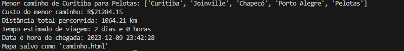
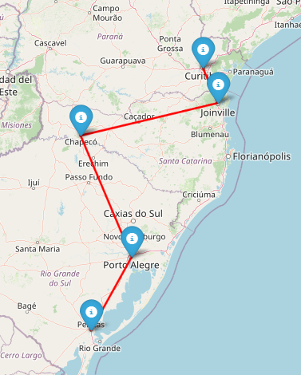
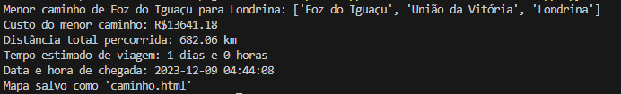
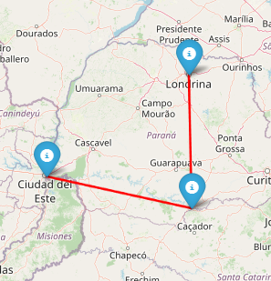

# Sistema de Logística de Rotas

Este projeto implementa um sistema de logística de rotas para otimizar o transporte entre cidades.

## Alunos

1. Pedro Henrique Serafini (RA: 172211008)
1. Rodrigo De Souza Alves (RA: 172211874)
1. Leonardo Rebouças Busato (RA: 172213039)

## Funcionalidades

- Encontrar o menor caminho entre duas cidades.
- Validar regras de negócio para otimizar as rotas.
- Cálculo de custo, distância e tempo estimado para o transporte.

## Tecnologias Utilizadas

- Python
- NetworkX (biblioteca para grafos)
- Geopy (para cálculos de distância geodésica)
- Folium (para visualização em mapas interativos)

## Como Usar

1. **Instalação:**
   Certifique-se de ter o Python e as bibliotecas necessárias instaladas. Você pode instalar as dependências usando:

   ```bash
   pip install networkx geopy folium
   ```
## Execução:

Execute o script Python principal:

```bash
python logistica_rotas.py
```

## Entrada de Dados:

- Modifique as informações das cidades no script, se necessário.
- Defina as rotas e regras de negócio conforme especificado no código.
  
## Resultados:

O script exibirá o menor caminho, custo, distância e tempo estimado.
Um mapa interativo será gerado e salvo como 'caminho.html'.

## Exemplo de Uso

```bash
ponto_partida = "Curitiba"
destino = "Pelotas"
caminho, custo, distancia, dias, data_chegada = encontrar_menor_caminho_com_regras(ponto_partida, destino)
```







## Contribuições

Contribuições são bem-vindas! Sinta-se à vontade para abrir problemas (issues) e enviar pull requests.

## Licença
Este projeto está licenciado sob a Licença MIT - consulte o arquivo LICENSE.md para obter detalhes.
